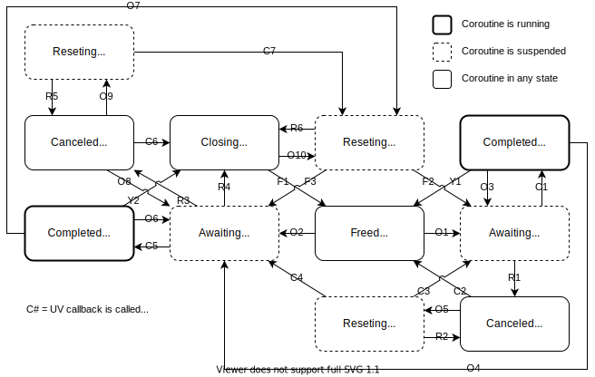
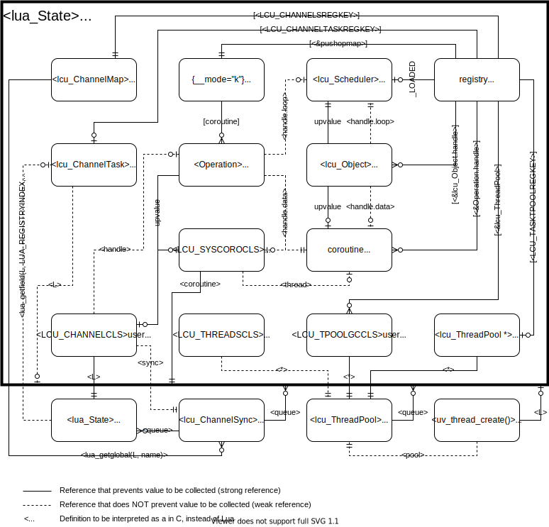

Terminology in Code
===================

Operations
----------

CoUtil categorizes UV asynchronous operations into the following categories:

### Request Operations (`reqop`)

- Requires a UV request ([`uv_req_t`](http://docs.libuv.org/en/v1.x/request.html)).
- Requires an initialized `uv_loop_t` structure.
- Started using a UV function that register a single-shot callback, which is eventually called and indicates the UV request is freed.

| Definition | Description |
| :--- | :--- |
| `uv_<request>_t` | UV request type |
| `uv_<request>_cb` | callback pointer type, which is called when the operation terminates and the request is free. |
| `uv_<request>(uv_loop_t*, uv_<request>_t*, <arguments>, uv_<request>_cb);` | starts the operation on UV event loop `loop` with the provided arguments, and registering the callback. |

### Thread Operations (`throp`)

- Requires a UV handle ([`uv_handle_t`](http://docs.libuv.org/en/v1.x/handle.html)),
but not associated with a system object (_e.g._ file descriptor).
- Requires an initialized `uv_loop_t` structure.
- Started using a UV function that registers a callback to be continuously called until the operation is stopped using another UV function.
- Terminated by function `uv_close`,
which registers an additional callback to be called when the UV handle is freed.

| Definition | Description |
| :--- | :--- |
| `uv_<handler>_t` | UV handle type |
| `uv_<handler>_cb` | callback pointer type, which is called while the operation is active. |
| `uv_<handler>_init(uv_loop_t*, uv_<handler>_t*);` | associates the handler with UV event loop `loop`. |
| `uv_<handler>_start(uv_<handler>_t*, <arguments>, uv_<handler>_cb);` | starts the operation with the provided arguments, and registering the callback. |
| `uv_<handler>_stop(uv_<handler>_t*);` | stops the operation, so the callback is not called until started again. |

### Object Operations (`objop`)

Same as [Thread Operations](#thread-operations-throp),
but when the handle is associated with a system object (_e.g._ file descriptor).
In particular,
such handles cannot be replicated by multiple coroutines.
Therefore,
the operation on such system object can only be performed by one coroutine at time.

Identifiers
-----------

| Short | Long | Description |
| ----- | ---- | ----------- |
| `loop` | `loop` | [UV loop](http://docs.libuv.org/en/v1.x/loop.html) |
| `hdl` | `handle` | [UV handle](http://docs.libuv.org/en/v1.x/handle.html) |
| `req` | `request` | [UV request](http://docs.libuv.org/en/v1.x/request.html) |
| `thr` | `thread` | [Lua coroutine](http://www.lua.org/manual/5.3/manual.html#2.6) |
| `idx` | `index` | [Lua stack index](http://www.lua.org/manual/5.3/manual.html#4.3) |
| `arg` | `argument` | [Lua function argument position](http://www.lua.org/manual/5.3/manual.html#lua_CFunction) |
| `obj` | `object` | System resource representation (_e.g._ socket, file, process) |
| `op` | `operation` | Asynchronous operation over [UV library](https://libuv.org/). |

Functions
---------

| Decoration | Type | Description |
| ---------- | ---- | ----------- |
| `lcu_` | `prefix` | API for manipulation of CoUtil values |
| `lcuL_` | `prefix` | API with utilility Lua functions |
| `lcuU_` | `prefix` | API for UV callbacks (see note 1). |
| `lcuT_` | `prefix` | API for thread operations (see note 2). |
| `uv_on` | `prefix` | UV callback function. |
| `k_` | `prefix` | Lua continuation function. |
| `k` | `suffix` | Function that yields with a continuation. |

### Notes

1. Requires an active `uv_loop_t` (**while `system.run()` is running**).
2. Requires `lua_State` of a call to a function with **module upvalues**.
Can be used with `(lua_State *)uv_loop_t.data` while `system.run()` is running.

Source Files
============


| Source Files | Contents Type | Description |
| ------------ | ------------- | ----------- |
| `lchannem.c` | Lua module | [`coutil.channel`](#channels) and [`system.awaitch`](manual.md#systemawaitch-ch-endpoint-) |
| `lchaux.{c,h}` | internal | inter-thread channel basic support |
| `lchdefs.h` | internal | inter-thread channel structures |
| `lcoroutm.c` | Lua module | [`coutil.coroutine`](manual.md#preemptive-coroutines) and [`system.resume`](manual.md#systemresume-preemptco-) |
| `lcuconf.h` | configuration | general implementation configurations |
| `lfilef.c` | Lua functions | file system functions of [`coutil.system`](manual.md#system-features) |
| `lmodaux.{c,h}` | internal | Lua general utilities |
| `loperaux.{c,h}` | internal | [await function](manual.md#await) support for [UV operations](#operations) |
| `lprocesf.c` | Lua functions | process and signal functions of [`coutil.system`](manual.md#system-features) |
| `lscheduf.c` | Lua functions | event loop functions of [`coutil.system`](manual.md#system-features) |
| `lsocketf.c` | Lua functions | socket functions of [`coutil.system`](manual.md#system-features) |
| `lsystemm.c` | Lua module | [`coutil.system`](manual.md#system-features) |
| `lthpool.{c,h}` | internal | thread pool basic support |
| `lthreadm.c` | Lua module | [`coutil.threads`](manual.md#thread-pools) |
| `ltimef.c` | Lua functions | time functions of [`coutil.system`](manual.md#system-features) |

Implementation Templates
========================

Request Operation
-----------------

```c
LCUI_FUNC void lcuM_addmyawaitf (lua_State *L) {
	static const luaL_Reg modf[] = {
		{"myawait", lua_myawait},
		{NULL, NULL}
	};
	lcuM_setfuncs(L, modf, LCU_MODUPVS);
}

static int lua_myawait (lua_State *L) {
	lcu_Scheduler *sched = lcu_getsched(L);  /* requires 'LCU_MODUPVS' upvalues */
	return lcuT_resetreqopk(L, sched, k_setupfunc, onreturn, cancancel);
}

static int k_setupfunc (lua_State *L, uv_req_t *request, uv_loop_t *loop) {
	uv_myevent_t *myevent = (uv_myevent_t *)request;
	/* check argments and obtain desired configs for myevent */
	/* leave on the stack values required to produce the results */
	int err = uv_myevent(loop, myevent, uv_onmyevent, /* configs */);
	if (err < 0) return lcuL_pusherrres(L, err);
	return -1;  /* yield on success */
}

/* optional, if is 'NULL' behaves as 'return 1' */
static int cancancel (lua_State *L) {
	/* we know the thread is not awaiting for this myevent anymore */
	/* inpect any global state that might need clean up */
	if (/* we still need 'uv_onmyevent' to be called for some clean up */)
		return 0;
	else
		return 1;
}

static void uv_onmyevent (uv_myevent_t *myrequest, /* myevent details */) {
	uv_loop_t *loop = myrequest->loop;
	uv_req_t *request = (uv_req_t *)myrequest;
	lua_State *thread = lcuU_endreqop(loop, request);
	if (thread) {
		/* push values to yield to 'thread', for 'onreturn' to process */
		lcuU_resumereqop(loop, request, /* number of pushed values */);
	} else {
		/* request wasn't canceled, we can do the clean up now */
	}
}

/* optional, if is 'NULL' behaves as 'return lua_gettop(L)' */
static int onreturn (lua_State *L) {
	/* use values left on the stack by 'k_setupfunc' and the ones yielded */
	/* by 'uv_onmyevent' to produce the values to be returned */
	return /* number of values to return from the top of the stack */;
}
```

Thread Operation
----------------

```c
LCUI_FUNC void lcuM_addmyawaitf (lua_State *L) {
	static const luaL_Reg modf[] = {
		{"myawait", lua_myawait},
		{NULL, NULL}
	};
	lcuM_setfuncs(L, modf, LCU_MODUPVS);
}

static int lua_myawait (lua_State *L) {
	lcu_Scheduler *sched = lcu_getsched(L);  /* requires 'LCU_MODUPVS' upvalues */
	return lcuT_resetthropk(L, UV_MYEVENT, sched, k_setupfunc, onreturn, cancancel);
}

static int k_setupfunc (lua_State *L, uv_handle_t *handle, uv_loop_t *loop) {
	uv_myevent_t *myevent = (uv_myevent_t *)handle;
	/* check argments and obtain desired configs for myevent */
	/* leave on the stack values required to produce the results */
	int err = 0;
	if (loop) err = lcuT_armthrop(L, uv_myevent_init(loop, myevent));
	else if (/* myevent is misconfigured? */) err = uv_myevent_stop(myevent);
	else return -1;  /* yield on success */
	if (err >= 0) err = uv_myevent_start(myevent, uv_onmyevent, /* configs */);
	if (err < 0) return lcuL_pusherrres(L, err);
	return -1;  /* yield on success */
}

/* optional, if is 'NULL' behaves as 'return 1' */
static int cancancel (lua_State *L) {
	/* we know the thread is not awaiting for this myevent anymore */
	/* inpect any global state that might need clean up */
	if (/* we still need 'uv_onmyevent' to be called for some clean up */)
		return 0;
	else
		return 1;
}

static void uv_onmyevent (uv_myevent_t *handle, /* myevent details */) {
	if (lcuU_endthrop(handle)) {
		lua_State *thread = (lua_State *)handle->data;
		/* push values to yield to 'thread', for 'onreturn' to process */
		lcuU_resumethrop((uv_handle_t *)handle, /* number of pushed values */);
	} else {
		/* 'cancancel' returned 0, and we can do the clean up now */
	}
}

/* optional, if is 'NULL' behaves as 'return lua_gettop(L)' */
static int onreturn (lua_State *L) {
	/* use values left on the stack by 'k_setupfunc' and the ones yielded */
	/* by 'uv_onmyevent' to produce the values to be returned */
	return /* number of values to return from the top of the stack */;
}
```

Object Operation
----------------

```c
#define MYOBJECT_CLASS	LCU_PREFIX"MyObject"

LCUI_FUNC void lcuM_addmyawaitf (lua_State *L) {
	static const luaL_Reg metf[] = {
		{"__gc", myobj_gc},
		{"__close", myobj_gc},
		{"close", myobj_close},
		{"await", myobj_await},
		{NULL, NULL}
	};
	static const luaL_Reg modf[] = {
		{"myobject", lua_myobject},
		{NULL, NULL}
	};
	/* create object metatable */
	luaL_newmetatable(L, MYOBJECT_CLASS);
	lcuL_setfuncs(L, metf, 0);
	lua_pop(L, 1);
	/* add object creation function to 'coutil.system' */
	lcuM_setfuncs(L, modf, LCU_MODUPVS);
}

typedef struct MyObject {
	/* same fields from 'lcu_Object' */
	int flags;
	lcu_ObjectAction stop;
	lua_CFunction step;
	uv_myobject_t handle;  /* is 'uv_handle_t' in 'lcu_Object' */
	/* any extra fields */
} MyObject;

static int lua_myobject (lua_State *L) {
	lcu_Scheduler *sched = lcu_getsched(L);  /* requires 'LCU_MODUPVS' upvalues */
	MyObject *myobj = lcuT_newobject(L, MyObject, MYOBJECT_CLASS);
	/* check argments and obtain desired configs for 'myobj' */
	int err = uv_myobject_init(loop, lcu_toobjhdl(myobj), /* configs */);
	if (err < 0) return lcuL_pusherrres(L, err);
	/* initialize any extra fields */
	return 1;
}

static int myobj_gc (lua_State *L) {
	luaL_checkudata(L, 1, MYOBJECT_CLASS);
	lcu_closeobj(L, 1);
	return 0;
}

static int myobj_close (lua_State *L) {
	luaL_checkudata(L, 1, MYOBJECT_CLASS);
	lua_pushboolean(L, lcu_closeobj(L, 1));
	return 1;
}

static int myobj_await (lua_State *L) {
	lcu_Object *object = (lcu_Object *)luaL_checkudata(L, 1, MYOBJECT_CLASS);
	luaL_argcheck(L, !lcuL_maskflag(object, LCU_OBJCLOSEDFLAG), 1, "closed object");
	return lcuT_resetobjopk(L, object, startmyawait, stopmyawait, onreturn);
}

static int startmyawait (uv_handle_t *handle) {
	return uv_myobj_myevent_start((uv_myobject_t *)handle, uv_onmyevent);
}

static int stopmyawait (uv_handle_t *handle) {
	return uv_myobj_myevent_stop((uv_myobject_t *)handle);
}

static void uv_onmyevent (uv_myobject_t *myobjhdl, /* myevent details */) {
	uv_handle_t *handle = (uv_handle_t *)myobjhdl;
	lua_State *thread = (lua_State *)handle->data;
	lcu_assert(thread);
	/* push values to yield to 'k_onreturn' */
	lcuU_resumeobjop(handle, /* number of pushed values */);
}

static int onreturn (lua_State *L) {
	/* use values left on the stack by 'myobj_await' and the ones yielded */
	/* by 'uv_onmyevent' to produce the values to be returned */
	return /* number of values to return from the top of the stack */;
}
```

Data Structure States
=====================

Operation
---------



| Name                           | R | S | P | C | lua_KFunction | Callback Pending        |
|:------------------------------ |:-:|:-:|:-:|:-:|:------------- |:----------------------- |
| Freed              Operation   | R |   |   |   |               |                         |
| Awaiting           Request Op. | R | S | P |   | `k_endop`     | `uv_<request>_cb`       |
| Completed          Request Op. | R | S |   |   |               |                         |
| Canceled           Request Op. | R | S |   | ? |               | `uv_<request>_cb`       |
| Reseting           Request Op. | R | S | P | ? | `k_resetopk`  | `uv_<request>_cb`       |
| Awaiting           Thread Op.  |   |   | P |   | `k_endop`     | `uv_<handle>_cb`        |
| Completed          Thread Op.  |   |   |   |   |               | `uv_<handle>_cb`        |
| Canceled           Thread Op.  |   |   |   | C |               | `uv_<handle>_cb`        |
| Reseting  Canceled Thread Op.  |   |   | P | C | `k_resetopk`  | `uv_<handle>_cb`        |
| Closing            Thread Op.  |   |   |   |   |               | `closedhdl:uv_close_cb` |
| Reseting  Closed   Thread Op.  |   |   | P |   | `k_resetopk`  | `closedhdl:uv_close_cb` |
_______________________
- R: `FLAG_REQUEST` is set in coroutines's `Operation.flags`.
- S: `FLAG_THRSAVED` is set in coroutines's `Operation.flags`.
- P: `FLAG_PENDING` is set in coroutines's `Operation.flags`.
- C: `FLAG_NOCANCEL` is set in coroutines's `Operation.flags`.

Object
------


| Name      | S | P | C | lua_KFunction | Callback Pending        |
|:--------- |:-:|:-:|:-:|:------------- |:----------------------- |
| Ready     |   |   |   |               |                         |
| Closing   |   |   | C |               | `closedobj:uv_close_cb` |
| Freed     |   |   | C |               |                         |
| Awaiting  | S | P |   | `k_endobjopk` | `uv_<handle>_cb`        |
| Completed | S |   |   |               |                         |
_______________________
- S: (started) `stop` and `step` fields are not `NULL` in `lcu_Object`.
- P: (pending) `handle.data` is not `NULL` in `lcu_Object`.
- C: (closed) `LCU_OBJCLOSEDFLAG` is set in `lcu_Object.flags`.

Transitions
-----------

### [C]allback

1. `uv_<request>_cb`
	- `lcuU_endreqop`
	- `lcuU_resumereqop...`
		- `k_endop`
2. `uv_<request>_cb`
	- `lcuU_endreqop`
3. `uv_<request>_cb`
	- `lcuU_endreqop`
	- `lcuU_resumereqop...`
		- `k_resetopk`
			- `uv_<request>`
			- `startedopk`
4. `uv_<request>_cb`
	- `lcuU_endreqop`
	- `lcuU_resumereqop...`
		- `k_resetopk`
			- `uv_<handle>_init`
			- `lcuT_armthrop`
			- `uv_<handle>_start`
			- `startedopk`
5. `uv_<handle>_cb`
	- `lcuU_endthrop`
	- `lcuU_resumethrop...`
		- `k_endop`
6. `uv_<handle>_cb`
	- `lcuU_endthrop`
		- `cancelop`
			- `uv_close`
7. `uv_<handle>_cb`
	- `lcuU_endthrop`
	- `cancelop`
		- `uv_close`
8. `uv_<handle>_cb`
	- `lcuU_resumeobjop...`
		- `k_endobjopk`

### [F]reed

1. `closedhdl`
2. `closedhdl`
	- `lcuU_resumereqop...`
		- `k_resetopk`
			- `uv_<request>`
			- `startedopk`
3. `closedhdl`
	- `lcuU_resumereqop...`
		- `k_resetopk`
			- `uv_<handle>_init`
			- `lcuT_armthrop`
			- `uv_<handle>_start`
			- `startedopk`
4. `closedobj`

### [G]arbage

1. `lcu_closeobj`
	- `uv_close`
2. `lcu_closeobj`
	- `uv_close`
3. `lcu_closeobj`
	- `uv_close`

### [O]peration

1. `lcuT_resetreqopk`
	- `uv_<request>`
	- `startedopk`
2. `lcuT_resetthropk`
	- `uv_<handle>_init`
	- `lcuT_armthrop`
	- `uv_<handle>_start`
	- `startedopk`
3. `lcuT_resetreqopk`
	- `uv_<request>`
	- `startedopk`
	- `...lcuU_resumereqop`
4. `lcuT_resetthropk`
	- `uv_<handle>_init`
	- `lcuT_armthrop`
	- `uv_<handle>_start`
	- `startedopk`
	- `...lcuU_resumereqop`
5. `lcuT_resetreqopk|lcuT_resetthropk`
	- `yieldresetk`
6. `lcuT_resetthropk` (`checkreset() == SAMEOP`)
	- `uv_<handle>_stop`?
	- `uv_<handle>_start`?
	- `startedopk`
	- `...lcuU_resumethrop`
7. `lcuT_resetreqopk|lcuT_resetthropk`
	- `checkreset` (`== WAITOP`)
		- `uv_close`
	- `yieldresetk`
	- `...lcuU_resumethrop`
8. `lcuT_resetthropk` (`checkreset() == SAMEOP`)
	- `uv_<handle>_stop`?
	- `uv_<handle>_start`?
	- `startedopk`
9. `lcuT_resetreqopk|lcuT_resetthropk`
	- `yieldresetk`
10. `lcuT_resetreqopk|lcuT_resetthropk`
	- `yieldresetk`
11. `lcuT_resetobjopk`
	- `uv_<handle>_start`
12. `lcuT_resetobjopk`

### [R]esumed

1. `k_endop`
	- `cancelop`?
		- `uv_cancel`
2. `k_resetopk`
3. `k_endop` (`cancancel() == 0`)
4. `k_endop` (`cancancel() == 1`)
	- `cancelop`
		- `uv_close`
5. `k_resetopk`
6. `k_resetopk`
7. `k_endobjopk`
	- `stopobjop`
		- `uv_<handle>_stop`

### [Y]ields

1. `...lcuU_resumereqop`
2. `...lcuU_resumethrop`
	- `cancelop`
		- `uv_close`
3. `...lcuU_resumeobjop`
	- `stopobjop`
		- `uv_<handle>_stop`

References to Values
====================


