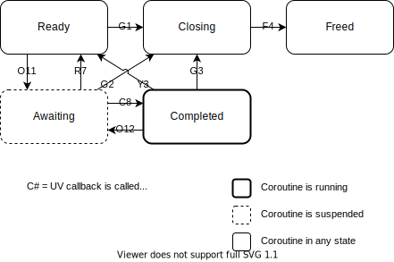

Terminology
===========

Operations
----------

CoUtil categorizes UV asynchronous operations into the following categories:

### Request Operations (`reqop`)

Asynchronous operation perfomed over a UV request (`uv_req_t`).

| Operation | Request | Callback |
| --------- | ------- | -------- |
| `tcp:send` | `UV_WRITE` | `uv_write_cb` |
| `tcp:connect` | `UV_CONNECT` | `uv_connect_cb` |
| `tcp:shutdown` | `UV_SHUTDOWN` | `uv_shutdown_cb` |
| `udp:send` | `UV_UDP_SEND` | `uv_udp_send_cb` |
| `system.findaddr` | `UV_GETADDRINFO` | `uv_getaddrinfo_cb` |
| `system.nameaddr` | `UV_GETNAMEINFO` | `uv_getnameinfo_cb` |
| --------- | ------- | -------- |
| `file:*` | `UV_FS` | `uv_fs_cb` |

### Thread Operations (`throp`)

Asynchronous operation perfomed over a UV handle that can be replicated for different threads resulting in the same effect.

| Operation | Handle | Callback |
| --------- | ------ | -------- |
| `system.suspend` | `UV_IDLE` | `uv_idle_cb` |
| `system.suspend` | `UV_TIMER` | `uv_timer_cb` |
| `system.awaitsig` | `UV_SIGNAL` | `uv_signal_cb` |
| `system.execute` | `UV_PROCESS` | `uv_exit_cb` |
| --------- | ------ | -------- |
| `system.awaitpath` | `UV_FS_EVENT` | `uv_fs_event_cb` |
| `system.awaitpath` | `UV_FS_POLL` | `uv_fs_poll_cb` |

### Object Operations (`objop`)

Asynchronous operation perfomed over a UV handle associated with a system resource with is own identity that cannot be replicated for each thread (_e.g._ socket, pipe or TTY file).

| Operation | Handle | Callback |
| --------- | ------ | -------- |
| `udp:receive` | `UV_UDP` | `uv_udp_recv_cb` |
| `tcp:receive` | `UV_TCP` | `uv_read_cb` |
| `tcp:accept` | `UV_TCP` | `uv_connection_cb` |
| `pipe:receive` | `UV_NAMED_PIPE` | `uv_read_cb` |
| `pipe:accept` | `UV_NAMED_PIPE` | `uv_connection_cb` |
| --------- | ------ | -------- |
| `tty:receive` | `UV_TTY` | `uv_read_cb` |
| `tty:accept` | `UV_TTY` | `uv_connection_cb` |

Identifiers
-----------

| Short | Long | Description |
| ----- | ---- | ----------- |
| `loop` | `loop` | [UV loop](http://docs.libuv.org/en/v1.x/loop.html) |
| `hdl` | `handle` | [UV handle](http://docs.libuv.org/en/v1.x/handle.html) |
| `req` | `request` | [UV request](http://docs.libuv.org/en/v1.x/request.html) |
| `thr` | `thread` | [Lua coroutine](http://www.lua.org/manual/5.3/manual.html#2.6) |
| `kctx` | `kcontext` | [Lua continuation context](http://www.lua.org/manual/5.3/manual.html#lua_KContext) |
| `kfn` | `kfunction` | [Lua continuation function](http://www.lua.org/manual/5.3/manual.html#lua_KFunction) |
| `idx` | `index` | [Lua stack index](http://www.lua.org/manual/5.3/manual.html#4.3) |
| `arg` | `argument` | [Lua function argument position](http://www.lua.org/manual/5.3/manual.html#lua_CFunction) |
| `obj` | `object` | System resource representation (_e.g._ socket, file, process) |
| `flg` | `flags` | [Bit field](https://en.wikipedia.org/wiki/Bit_field) |
| `op` | `operation` | Asynchronous operation over [UV library](https://libuv.org/). |

Functions
---------

| Decoration | Type | Description |
| ---------- | ---- | ----------- |
| `lcu_` | `prefix` | API for manipulation of CoUtil values |
| `lcuL_` | `prefix` | API with utilility Lua functions |
| `lcuU_` | `prefix` | API for UV callbacks (see note 1). |
| `lcuT_` | `prefix` | API for thread operations (see note 2). |
| `uv_on` | `prefix` | UV callback function. |
| `k_` | `prefix` | Lua continuation function. |
| `k` | `suffix` | Function that yields with a continuation. |

### Notes

1. Requires an active `uv_loop_t` (**while `system.run()` is running**).
2. Requires `lua_State` of a call to a function with **module upvalues**.
Can be used with `(lua_State *)uv_loop_t.data` while `system.run()` is running.

Modules
=======

Internal
--------

### `lcuconf.h`

Definitions to customize implementation in similar fashion to `luaconf.h` of Lua.

| Name | Type | Description |
| ---- | ---- | ----------- |
| LCUI_FUNC | function prefix | prefix for internal functions. |
| LCULIB_API | function prefix | prefix for API functions. |
| LCUMOD_API | function prefix | prefix for `luaopen_` functions. |
| LCU_PREFIX | string | prefix for metatables. |
| LCU_PIPEADDRBUF | number | max. length of [pipe names](manual.md#socketgetaddress-site--address) (Unix path or Windows pipe names). |
| LCU_EXECARGCOUNT | number | max. number of arguments for a [new process](manual.md#systemexecute-cmd-). |
| LCU_NETHOSTNAMESZ | number | max. length of [resolved host names](manual.md#systemnameaddr-address--mode). |
| LCU_NETSERVNAMESZ | number | max. length of [resolved service names](manual.md#systemnameaddr-address--mode). |
| lcu_assert assert | function macro | function for internal assertions. |

### `lmodaux.c`:

Auxiliary functions for implementation of Lua modules.

### `loperaux.c`: 

Auxiliary functions for implementation of module operations,
specially [await functions](manual.md#await).

```c
void lcuT_savevalue (lua_State *L, void *key);
```

```c
void lcuT_freevalue (lua_State *L, void *key);
```

```c
void lcuU_checksuspend(uv_loop_t *loop);
```

```c
typedef int (*lcu_RequestSetup) (lua_State *L, uv_req_t *r, uv_loop_t *l);
```

```c
int lcuT_resetreqopk (lua_State *L,
                      lcu_Scheduler *sched,
                      lcu_RequestSetup setup,
                      lua_CFunction results,
                      lua_CFunction cancel);
```

Function used to implement an await function that setups a UV callback using a `uv_req_t` to later resume the calling coroutine.

It yields the current coroutine repeatedly until its correponding `uv_req_t` is no longer in use.
Then it executes function `setup`,
providing `L` with the same stack values,
and the `uv_req_t` to be initated,
and the `uv_loop_t` of `sched`.

`setup` shall return -1 when it succesfully set up the `uv_req_t`,
to signal that this function shall yield,
expecting to be resumed by `lcuU_resumereqop` from a UV callback.
Otherwise this function returns the value returned by `setup`,
which shall place on the stack of `L` the values to be returned by function calling this function.

If `results` and `cancel` are not `NULL`,
they are registered to be called when the coroutine is resumed,
much like a continuation.
`results` is called if the coroutine is resumed by `lcuU_resumereqop`.
Otherwise,
`cancel` is called,
and shall return 0 if the `uv_req_t` shall not be cancelled by a `uv_cancel`.

```c
lua_State *lcuU_endreqop (uv_loop_t *loop, uv_req_t *request);
```

Function called from a UV callback to release the used `uv_req_t`.
It releases `request` to be reused (_e.g._ `lcuT_resetreqopk`).
Returns `NULL` if there is no coroutine waiting on the `request` anymore.
Otherwise,
returns the coroutine that should be resumed by `lcuU_resumereqop`.

```c
int lcuU_resumereqop (uv_loop_t *loop, uv_req_t *request, int narg);
```

Function called from a UV callback to resume the awating coroutine obtained by `lcuU_endreqop`.
It resumes `thread` providing the `narg` values of the top of the stack as arguments,
and using the `lua_State` executing `loop` as parent.
Returns the same status of `lua_resume`.


```c
typedef int (*lcu_HandleSetup) (lua_State *L, uv_handle_t *h, uv_loop_t *l);
```

```c
int lcuT_resetthropk (lua_State *L,
                      uv_handle_type type,
                      lcu_Scheduler *sched,
                      lcu_HandleSetup setup,
                      lua_CFunction results,
                      lua_CFunction cancel);
```

Function used to implement an await function that setups a UV callback using a `uv_handle_t` to later resume the calling coroutine.

It yields the current coroutine repeatedly until its correponding `uv_handle_t` is no longer in use,
or is of the same type as `type`.
Then it executes function `setup`,
providing `L` with the same stack values,
and the `uv_handle_t` to be initated.
The `uv_loop_t` is only provided if the `uv_handle_t` is not currently active as a UV handle of type `type`,
and is the same value as argument `loop`.

`setup` shall return -1 when it succesfully set up the `uv_handle_t`,
to signal that this function shall yield,
expecting to be resumed by `lcuU_resumereqop` from a UV callback.
Otherwise this function returns the value returned by `setup`,
which shall place on the stack of `L` the values to be returned by function calling this function.

If `results` and `cancel` are not `NULL`,
they are registered to be called when the coroutine is resumed,
much like a continuation.
`results` is called if the coroutine is resumed by `lcuU_resumethrop`.
Otherwise,
`cancel` is called,
and shall return 0 if the `uv_handle_t` shall not be cancelled by a `uv_close`.

```c
int lcuT_armthrop (lua_State *L, int err);
```

Function used in `setup` function passed to `lcuT_resetthropk` to mark the `uv_handle_t` as active,
according to the return value `err` of a UV set up function.

This function should only be called when argument `loop` of function `setup` is provided.
Otherwise,
the UV handle is already active.
Returns the `err` return code.

```c
int lcuU_endthrop (uv_handle_t *handle);
```

Function called from a UV callback to release the used `uv_handle_t`.
It releases `handle` to be reused (_e.g._ `lcuT_resetthropk`).
Returns 0 if there is no coroutine waiting on the `request` anymore.
Otherwise,
returns 1.

This function is usually not necessary because the handle is closed using `uv_close` whenever the coroutine is resumed explicitly.
This function must be used only when the continuation `cancel` of `lcuT_resetthropk` is used and it returns 0 signaling that the handle shall not be closed even when the coroutine is not awaiting for it anymore.

```c
int lcuU_resumethrop (uv_handle_t *handle, int narg);
```
Function called from a UV callback to resume the awating coroutine obtained from `uv_handle_t.data`.
It resumes this coroutine providing the `narg` values of the top of the stack as arguments,
and using the `lua_State` executing the UV loop that triggered `handle` as parent.
Returns the same status of `lua_resume`.

```c
void lcuT_closeobjhdl (lua_State *L, int idx, uv_handle_t *handle);
```

```c
void lcuT_awaitobj (lua_State *L, uv_handle_t *handle);
```

```c
int lcuT_haltedobjop (lua_State *L, uv_handle_t *handle);
```

```c
int lcuU_resumeobjop (lua_State *thread, int narg,
                      uv_handle_t *handle);
```

API
---

### `lsyslib.c`: 

C API for manipulation of CoUtil Lua objects.

### `lsysmod.c`: 

Lua module of CoUtil.

States
======

Thread
------


### Transitions

|  # |  P | S | Action | Condition |
| -- | -- | - | ------ | --------- |
|  1 |    | T | `lcuT_resetreqopk` | UV request started |
|  1 |  7 | T | `resetop` | UV request reused |
|  1 |  8 | T | `resetop` | UV handle used as UV request |
|  2 |    | T | `lcuT_resetthropk+lcuT_armthrop` | UV handle initialized |
|  2 |  7 | T | `resetop` | UV request used as UV handle |
|  2 |  8 | T | `resetop` | UV handle reused |
|  3 |    | U | `lcuU_endreqop` | resumed by UV request callback |
|  4 |    | T | `endop` | resumed by `coroutine.resume` |
|  5 |  2 | T | `cancelop` | thread operation setup failed |
|  5 | 10 | T | `endop+cancelop` | resumed by `coroutine.resume` |
|  6 |    | U | `lcuU_resumethrop` | resumed by UV handle callback |
|  7 |    | U | `endop` | UV request concluded |
|  8 |    | U | `closedhdl` | UV handle closed |
|  9 |  6 | U | `cancelop` | coroutine suspended or terminated |
|  9 |  6 | T | `lcuT_resetthropk+uv_close` | different UV handle is active |
| 10 |  6 | T | `lcuT_resetthropk` | coroutine repeats operation |
_______________________
- P = Previous transition
- S = Call scope (T = thread; U = UV loop)

### Template

- Request Operation

```c
LCUI_FUNC void lcuM_addmyawaitf (lua_State *L) {
	static const luaL_Reg modf[] = {
		{"myawait", lua_myawait},
		{NULL, NULL}
	};
	lcuM_setfuncs(L, modf, LCU_MODUPVS);
}

static int lua_myawait (lua_State *L) {
	lcu_Scheduler *sched = lcu_getsched(L);  /* requires 'LCU_MODUPVS' upvalues */
	return lcuT_resetreqopk(L, sched, k_setupfunc, onreturn, cancancel);
}

static int k_setupfunc (lua_State *L, uv_handle_t *handle, uv_loop_t *loop) {
	uv_myevent_t *myevent = (uv_myevent_t *)handle;
	/* check argments and obtain desired configs for myevent */
	/* leave on the stack values required to produce the results */
	int err = uv_myevent(loop, myevent, uv_onmyevent, /* configs */);
	if (err < 0) return lcuL_pusherrres(L, err);
	return -1;  /* yield on success */
}

static int cancancel (lua_State *L) {
	/* we know the thread is not awaiting for this myevent anymore */
	/* inpect any global state that might need clean up */
	if (/* we still need 'uv_onmyevent' to be called for some clean up */)
		return 0;
	else
		return 1;
}

static void uv_onmyevent (uv_myevent_t *myrequest, /* myevent details */) {
	uv_loop_t *loop = myrequest->loop;
	uv_req_t *request = (uv_req_t *)myrequest;
	lua_State *thread = lcuU_endreqop(loop, request);
	if (thread) {
		/* push values to yield to 'thread', for 'onreturn' to process */
		lcuU_resumereqop(loop, request, /* number of pushed values */);
	} else {
		/* request wasn't cancelled, we can do the clean up now */
	}
}

static int onreturn (lua_State *L) {
	/* use values left on the stack by 'k_setupfunc' and the ones yielded */
	/* by 'uv_onmyevent' to produce the values to be returned */
	return /* number of values to return from the top of the stack */;
}
```

- Thread Operation

```c
LCUI_FUNC void lcuM_addmyawaitf (lua_State *L) {
	static const luaL_Reg modf[] = {
		{"myawait", lua_myawait},
		{NULL, NULL}
	};
	lcuM_setfuncs(L, modf, LCU_MODUPVS);
}

static int lua_myawait (lua_State *L) {
	lcu_Scheduler *sched = lcu_getsched(L);  /* requires 'LCU_MODUPVS' upvalues */
	return lcuT_resetthropk(L, UV_MYEVENT, sched, k_setupfunc, onreturn, cancancel);
}

static int k_setupfunc (lua_State *L, uv_handle_t *handle, uv_loop_t *loop) {
	uv_myevent_t *myevent = (uv_myevent_t *)handle;
	/* check argments and obtain desired configs for myevent */
	/* leave on the stack values required to produce the results */
	int err = 0;
	if (loop) err = lcuT_armthrop(L, uv_myevent_init(loop, myevent));
	else if (/* myevent is misconfigured? */) err = uv_myevent_stop(myevent);
	else return -1;  /* yield on success */
	if (err >= 0) err = uv_myevent_start(myevent, uv_onmyevent, /* configs */);
	// TODO: close 'myevent' when 'uv_myevent_start' fails!
	if (err < 0) return lcuL_pusherrres(L, err);
	return -1;  /* yield on success */
}

static int cancancel (lua_State *L) {
	/* we know the thread is not awaiting for this myevent anymore */
	/* inpect any global state that might need clean up */
	if (/* we still need 'uv_onmyevent' to be called for some clean up */)
		return 0;
	else
		return 1;
}

static void uv_onmyevent (uv_myevent_t *handle, /* myevent details */) {
	if (lcuU_endthrop(handle)) {
		lua_State *thread = (lua_State *)handle->data;
		/* push values to yield to 'thread', for 'onreturn' to process */
		lcuU_resumethrop((uv_handle_t *)handle, /* number of pushed values */);
	} else {
		/* 'cancancel' returned 0, and we can do the clean up now */
	}
}

static int onreturn (lua_State *L) {
	/* use values left on the stack by 'k_setupfunc' and the ones yielded */
	/* by 'uv_onmyevent' to produce the values to be returned */
	return /* number of values to return from the top of the stack */;
}
```

### Resources

- operation:
```c
/* from Lua stack (inside module closure) */
lcu_Operation *operation = tothrop(L);
/* from UV handle */
lcu_Operation *operation = (lcu_Operation *)handle;
/* from UV request */
lcu_Operation *operation = (lcu_Operation *)request;
```
- handle/request:
```c
if (lcuL_maskflag(op, FLAG_REQUEST)) {
	uv_req_t *request = torequest(operation);
} else {
	uv_handle_t *handle = tohandle(operation);
}
```
- coroutine:
```c
lua_State *thread = (lua_State *)( lcuL_maskflag(op, FLAG_REQUEST) ?
                                   torequest(op)->data :
                                   tohandle(op)->data );
```

### Conditions

- Freed:
```c
/* coroutine notification pending */
lcu_assert(lcuL_maskflag(operation, FLAG_REQUEST));
lcu_assert(!lcuL_maskflag(operation, FLAG_PENDING));
/* no armed operation */
uv_req_t *request = torequest(operation);
lcu_assert(request->type == UV_UNKNOWN_REQ);
/* coroutine is subject to garbage collection */
lua_pushlightuserdata(L, (void *)operation);
lcu_assert(lua_gettable(L, LCU_COREGISTRY) == LUA_TNIL);
```
- Armed:
```c
/* coroutine notification pending */
lcu_assert(!lcuL_maskflag(operation, FLAG_REQUEST));
lcu_assert(lcuL_maskflag(operation, FLAG_PENDING));
/* armed thread operation */
uv_handle_t *handle = tohandle(operation);
lcu_assert(handle->type != UV_UNKNOWN_HANDLE);
lcu_assert(!uv_is_closing(handle));
/* LCU_COREGISTRY[&operation] == coroutine */
lua_pushlightuserdata(L, (void *)operation);
lcu_assert(lua_gettable(L, LCU_COREGISTRY) == LUA_TTHREAD);
lcu_assert(lua_tothread(L, -1) == thread);
```
- Await:
```c
/* coroutine notification pending */
lcu_assert(lcuL_maskflag(operation, FLAG_PENDING));
if (lcuL_maskflag(op, FLAG_REQUEST)) {
	/* armed request operation */
	uv_req_t *request = torequest(operation);
	lcu_assert(request->type != UV_UNKNOWN_REQ);
} else {
	/* armed thread operation */
	uv_handle_t *handle = tohandle(operation);
	lcu_assert(handle->type != UV_UNKNOWN_HANDLE);
	lcu_assert(!uv_is_closing(handle));
}
/* LCU_COREGISTRY[&operation] == coroutine */
lua_pushlightuserdata(L, (void *)operation);
lcu_assert(lua_gettable(L, LCU_COREGISTRY) == LUA_TTHREAD);
lcu_assert(lua_tothread(L, -1) == thread);
```
- Close:
```c
/* coroutine notification pending */
if (lcuL_maskflag(op, FLAG_REQUEST)) {
	/* armed request operation */
	uv_req_t *request = torequest(operation);
	lcu_assert(request->type != UV_UNKNOWN_REQ);
} else {
	/* thread operation close pending */
	uv_handle_t *handle = tohandle(operation);
	lcu_assert(handle->type != UV_UNKNOWN_HANDLE);
	lcu_assert(uv_is_closing(handle));
}
/* LCU_COREGISTRY[&operation] == coroutine */
lua_pushlightuserdata(L, (void *)operation);
lcu_assert(lua_gettable(L, LCU_COREGISTRY) == LUA_TTHREAD);
lcu_assert(lua_tothread(L, -1) == thread);
```

Object
------



### Transitions

| # | P | S | Action | Condition |
| - | - | - | ------ | --------- |
| 1 |   | T | `lcu_closeobj` | object closed or collected |
| 2 |   | T | `lcuT_awaitobj` | UV handle started |
| 3 |   | U | `closedobj` | UV handle closed |
| 4 |   | T | `lcuT_haltedobjop` | resumed by `coroutine.resume` |
| 5 |   | T | `lcu_closeobj` | object closed or collected |
| 6 |   | U | `lcuU_resumeobjop` | resumed by UV handle callback |
| 7 | 6 | U | `freethread` | coroutine suspended or terminated |
| 8 | 6 | T | `lcu_closeobj` | object closed or collected |
| 9 | 6 | T | `lcuT_awaitobj` | coroutine repeated operation |
_______________________
- P = Previous transition
- S = Call scope (T = Thread; U = UV loop)

### Template

```c
#define MYOBJECT_CLASS	LCU_PREFIX"MyObject"

LCUI_FUNC void lcuM_addmyawaitf (lua_State *L) {
	static const luaL_Reg modf[] = {
		{"myobject", lua_myobject},
		{NULL, NULL}
	};
	lcuM_setfuncs(L, modf, LCU_MODUPVS);
}

typedef struct MyObject {
	int flags;
	uv_myobject_t handle;
	/* any extra fields */
}

static int lua_myobject (lua_State *L) {
	lcu_Scheduler *sched = lcu_getsched(L);  /* requires 'LCU_MODUPVS' upvalues */

	MyObject *myobj = (MyObject *)lua_newuserdatauv(L, sizeof(MyObject), 0);
	myobj->handle.data = NULL;
	myobj->flags = FLAG_CLOSED;
	luaL_setmetatable(L, MYOBJECT_CLASS);

	/* check argments and obtain desired configs for 'myobj' */
	int err = uv_myobject_init(loop, &myobj->handle, /* configs */);
	if (err < 0) return lcuL_pusherrres(L, err);
	/* initialize any extra fields */
	
	lcu_enableobj((lcu_Object *)myobj);
	return 1;
}

static int myobj_gc (lua_State *L) {
	MyObject *myobj = (MyObject *)luaL_checkudata(L, 1, MYOBJECT_CLASS);
	if (!lcu_isobjclosed((lcu_Object *)myobj);) {
		lcuL_closeobjhdl(L, 1, (uv_handle_t *)&myobj->handle);
		myobj->closed = 1;
	}
	return 0;
}

static int myobj_await (lua_State *L) {
	MyObject *myobj = (MyObject *)luaL_checkudata(L, 1, MYOBJECT_CLASS);
	uv_myobject_t *handle = &myobj->handle;
	lcu_Object *obj = (lcu_Object *)myobj;
	luaL_argcheck(L, handle->data == NULL, 1, "already in use");
	if (!lua_isyieldable(L)) luaL_error(L, "unable to yield");
	if (!lcu_getobjarmed(obj)) {
		int err = uv_myobj_myevent_start(handle, uv_onmyevent);
		if (err < 0) return lcuL_pushresults(L, 0, err);
		lcu_setobjarmed(obj, 1);
	}
	lcuT_awaitobj(L, (uv_handle_t *)handle);
	/* leave on the stack values required for the results */
	return lua_yieldk(L, 0, (lua_KContext)lua_gettop(L), k_onreturn);
}

static void uv_onmyevent (uv_myobject_t *myobjhdl, /* myevent details */) {
	uv_handle_t *handle = (uv_handle_t *)myobjhdl;
	lua_State *thread = (lua_State *)handle->data;
	lcu_assert(thread);
	/* push values to yield to 'thread', for 'onreturn' to process */
	lcuU_resumeobjop(handle, /* number of pushed values */);
	if (handle->data == NULL) {
		stop_myobj_myevent(myobjhdl);
	}
	lcuU_checksuspend(handle->loop);
}

static int k_onreturn (lua_State *L, int status, lua_KContext ctx) {
	lcu_assert(status == LUA_YIELD);
	if (lcuT_haltedobjop(L, (uv_handle_t *)handle)) {
		stop_myobj_myevent(handle);
	} else if (lua_isinteger(L, 6)) {
		handle->data = NULL;
		/* use values left on the stack by 'myobj_await' and the ones yielded */
		/* by 'uv_onmyevent' to produce the values to be returned */
		return /* number of values to return from the top of the stack */;
	}
	return lua_gettop(L)-((int)ctx);
}

static int stop_myobj_myevent (uv_myobject_t *myobjhdl) {
	uv_handle_t *handle = (uv_handle_t *)myobjhdl;
	int err = uv_myobj_myevent_stop(myobjhdl);
	if (err < 0) {
		lua_State *L = (lua_State *)handle->loop->data;
		lcuT_closeobjhdl(L, 1, handle);
		lcuL_warnerr(L, "myobject:await: ", err);
	}
	lcu_setobjarmed(lcu_tohdlobj(handle), 0);
}
```

### Resources

- `object`:
```c
/* from Lua stack */
lcu_##OBJTYPE *object = (lcu_##OBJTYPE *)luaL_testudata(L, arg, OBJMETATABLE);
/* from UV handle */
lcu_##OBJTYPE *object = (lcu_##OBJTYPE *)handle;
```
- `handle`:
```c
uv_handle_t *handle = &object->handle;
```
- `flags`:
```c
if (lcuL_maskflag(object, FLAG_CLOSED))
	lcu_clearflag(object, FLAG_CLOSED);
else
	lcu_setflag(object, FLAG_CLOSED);
```

### Conditions

- Ready:
```c
/* not being closed */
lcu_assert(!lcuL_maskflag(object, FLAG_CLOSED));
/* no awaiting coroutine */
lcu_assert(handle->data == NULL);
/* object is subject to garbage collection */
```
- Await:
```c
/* not being closed */
lcu_assert(!lcuL_maskflag(object, FLAG_CLOSED));
/* awaiting coroutine */
lua_State *thread = (lua_State *)handle->data;
lcu_assert(thread);
/* object in coroutine stack */
/* LCU_COREGISTRY[&handle] == coroutine */
lua_pushlightuserdata(L, (void *)handle);
lcu_assert(lua_gettable(L, LCU_COREGISTRY) == LUA_TTHREAD);
lcu_assert(lua_tothread(L, -1) == thread);
```
- Armed:
```c
/* not being closed */
lcu_assert(!lcuL_maskflag(object, FLAG_CLOSED));
/* no awaiting coroutine */
lcu_assert(handle->data == NULL);
/* object in coroutine stack */
/* LCU_COREGISTRY[&handle] == coroutine */
lua_pushlightuserdata(L, (void *)handle);
lcu_assert(lua_gettable(L, LCU_COREGISTRY) == LUA_TTHREAD);
lcu_assert(lua_tothread(L, -1) == thread);
```
- Close:
```c
/* not being closed */
lcu_assert(lcuL_maskflag(object, FLAG_CLOSED));
/* object is being closed */
lcu_assert(uv_is_closing(handle));
/* no awaiting coroutine */
lcu_assert(handle->data == NULL);
/* LCU_COREGISTRY[&handle] == object */
lua_pushlightuserdata(L, (void *)handle);
lcu_assert(lua_gettable(L, LCU_COREGISTRY) == LUA_TLIGHTUSERDATA);
lcu_assert(lua_touserdata(L, -1) == object);
```
- Freed:
```c
/* not being closed */
lcu_assert(lcuL_maskflag(object, FLAG_CLOSED));
/* no awaiting coroutine */
lcu_assert(handle->data == NULL);
/* object is subject to garbage collection */
```
